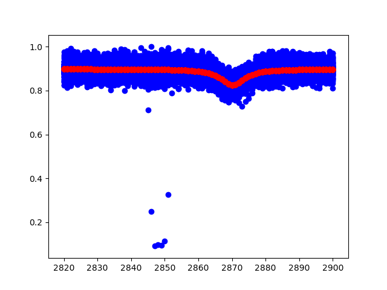

## Fit curves using Tensorflow

#### Prepare

```
tensorflow/tensorflow-gpu 2.0
pandas 0.25.3
```

#### Run

```
python fit.py
```

#### Result



#### TODO

- [x] epoch to steps
- [x] n particle model
- [x] simulation data
- [x] config file
- [ ] heuristic algorithm